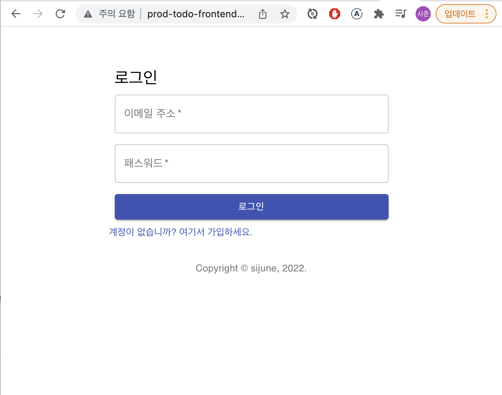
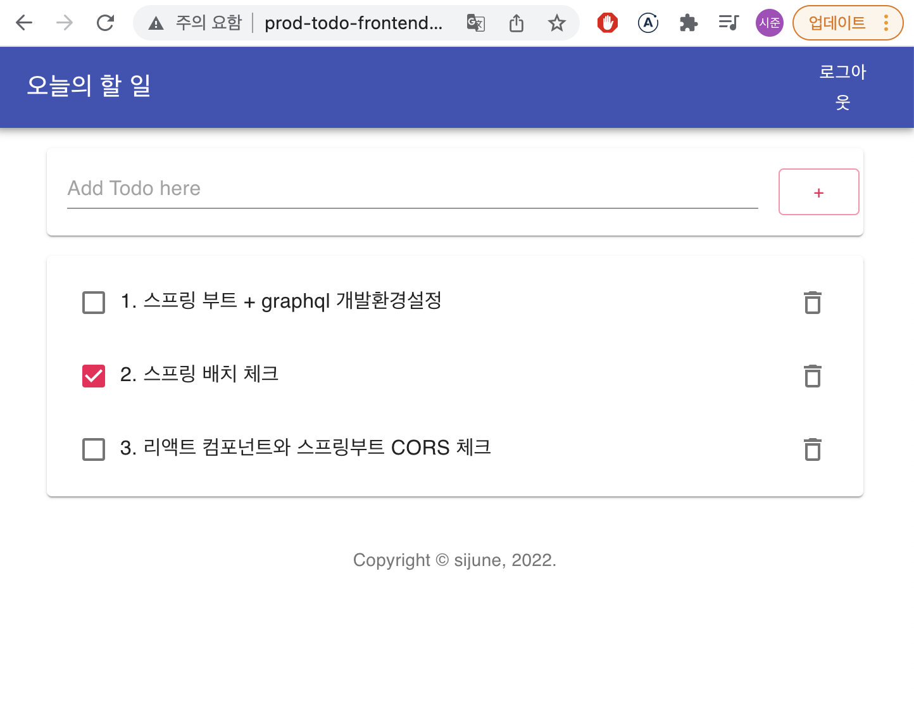

# Todo App 프론트엔드

React와 Spring Boot를 이용한 간단한 Todo App 구현

- Frontend : React
- Backend : Springboot
- DB : H2(개발), MySQL(운영)
- Infra : AWS Elastic Beanstalk(eb 커맨드라인 사용)
    

## 구현한 사항

- React State를 이용하여 웹 프론트엔드 구현
- Material UI를 이용해 UI 세팅
- CORS 문제를 해결 : Spring Boot WebMvcConfig에 오리진 설정
    

## 운영배포한 사항

- 프론트엔드 배포 url : http://prod-todo-frontend2.ap-northeast-2.elasticbeanstalk.com/ (현재 서버 DOWN)   

1. 로그인 페이지
      

2. TodoApp 화면
   

---

#### 파일 설명 (기본아키텍처 외)

- app-config.js : 백엔드 연결서버 지정(개발/운영)
- AppService.js : 전역으로 사용할 api call 함수 생성
